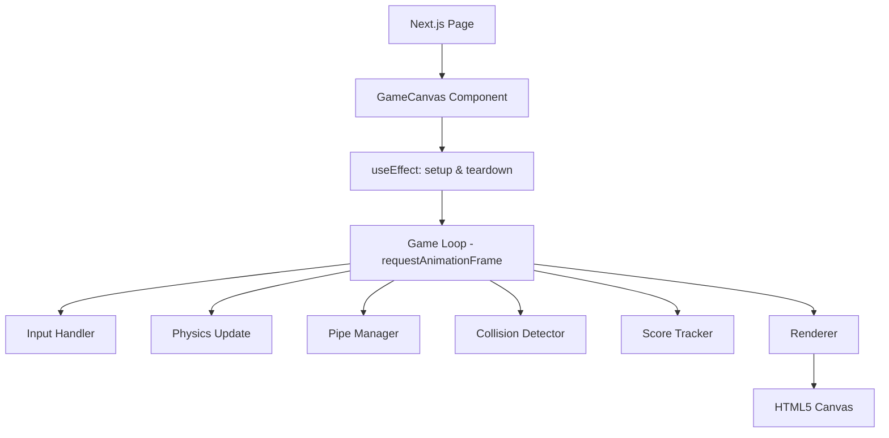
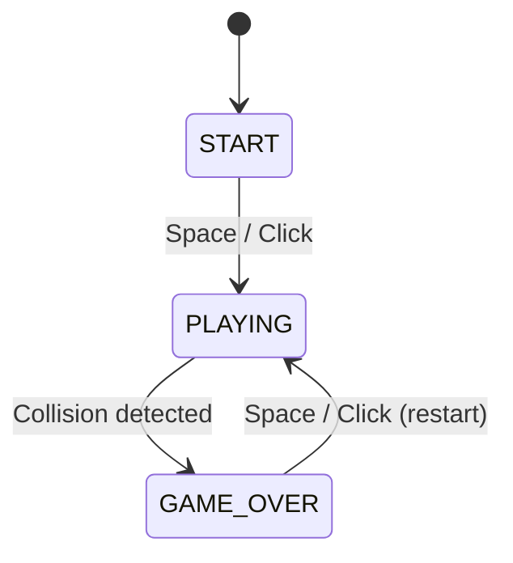

# Design Document: Flappy Bird Game

## Overview

This document describes the technical design for a Flappy Bird clone built as a Next.js web application. The game renders on an HTML5 Canvas element and is driven by a `requestAnimationFrame`-based game loop. The player controls a bird that moves forward automatically while gravity pulls it down; tapping Space or clicking makes the bird flap upward. The goal is to navigate through gaps between pipe obstacles without colliding.

The implementation lives entirely in the browser — no server-side logic is required beyond Next.js serving the page. All game state is held in memory for the duration of a session.

### Key Design Decisions

- **Canvas-based rendering** over DOM/CSS animation: gives precise per-pixel control at 60 fps and simplifies collision detection.
- **Single React component** wrapping the canvas: keeps the game self-contained and avoids React re-render overhead during the game loop.
- **Refs for mutable game state**: React state (`useState`) triggers re-renders; game loop variables are stored in `useRef` to avoid that overhead.
- **Relative units for physics constants**: all speeds and sizes are expressed as fractions of canvas dimensions so the game scales cleanly.

---

## Architecture

The game is a single Next.js page (`/app/page.tsx` or `/pages/index.tsx`) that renders a `<GameCanvas>` React component. All game logic lives inside that component, driven by a `useEffect` that starts the game loop.



### Game State Machine

The game moves through three states:



Each state controls which subsystems are active and what is rendered.

---

## Components and Interfaces

### GameCanvas Component

The top-level React component. Owns the canvas ref and all game-state refs.

```typescript
// src/components/GameCanvas.tsx
export default function GameCanvas(): JSX.Element
```

Responsibilities:
- Mount/unmount the canvas
- Attach and detach input event listeners
- Start and cancel the `requestAnimationFrame` loop
- Delegate per-frame work to subsystem functions

### Subsystem Functions

All subsystem functions are pure or near-pure functions that receive the current `GameState` and return an updated copy (or mutate the ref in place for performance-critical paths).

| Function | Signature | Purpose |
|---|---|---|
| `applyPhysics` | `(bird: Bird, dt: number) => Bird` | Apply gravity and velocity to bird position |
| `applyFlap` | `(bird: Bird) => Bird` | Apply upward velocity impulse |
| `updatePipes` | `(pipes: Pipe[], dt: number, canvasW: number) => Pipe[]` | Move pipes left, remove off-screen |
| `spawnPipe` | `(canvasW: number, canvasH: number, config: GameConfig) => Pipe` | Create a new pipe pair at random gap height |
| `checkCollision` | `(bird: Bird, pipes: Pipe[], canvasH: number) => boolean` | Bounding-box collision test |
| `updateScore` | `(score: number, bird: Bird, pipes: Pipe[]) => number` | Increment score when bird passes a pipe |
| `render` | `(ctx: CanvasRenderingContext2D, state: GameState, config: GameConfig) => void` | Draw all elements for one frame |

### Input Handler

A single `handleInput` function is registered for both `keydown` (Space) and `mousedown`/`touchstart` on the canvas. It reads the current game state and either starts the game, triggers a flap, or restarts.

```typescript
function handleInput(state: GameStateRef): void
```

---

## Data Models

### GameConfig (static, set once)

```typescript
interface GameConfig {
  canvasWidth: number;       // 400
  canvasHeight: number;      // 600
  gravity: number;           // pixels/s² (e.g. 1500)
  flapVelocity: number;      // pixels/s upward (e.g. -500)
  birdSpeed: number;         // pixels/s horizontal (e.g. 200)
  pipeWidth: number;         // pixels (e.g. 60)
  gapHeight: number;         // pixels (e.g. 150)
  pipeInterval: number;      // pixels traveled between spawns (e.g. 250)
  minGapY: number;           // minimum top of gap from canvas top (e.g. 60)
  maxGapY: number;           // maximum top of gap (canvasHeight - gapHeight - 60)
  targetFPS: number;         // 60
}
```

### Bird

```typescript
interface Bird {
  x: number;        // fixed horizontal position (canvasWidth * 0.25)
  y: number;        // vertical center of bird
  vy: number;       // vertical velocity (pixels/s)
  width: number;    // bounding box width (e.g. 34)
  height: number;   // bounding box height (e.g. 24)
}
```

### Pipe

```typescript
interface Pipe {
  x: number;        // left edge of pipe pair
  gapY: number;     // top of the gap (y coordinate)
  passed: boolean;  // true once the bird has passed this pipe (for scoring)
}
```

The upper pipe occupies `[x, 0]` to `[x + pipeWidth, gapY]`.  
The lower pipe occupies `[x, gapY + gapHeight]` to `[x + pipeWidth, canvasHeight]`.

### GameState

```typescript
type GamePhase = 'START' | 'PLAYING' | 'GAME_OVER';

interface GameState {
  phase: GamePhase;
  bird: Bird;
  pipes: Pipe[];
  score: number;
  distanceTraveled: number;  // tracks pixels traveled for pipe spawn interval
  lastTimestamp: number;     // for delta-time calculation
}
```

### Rendering Layers (draw order)

1. Background (sky fill)
2. Pipes (upper and lower segments)
3. Ground bar
4. Bird
5. HUD (score text)
6. Start screen overlay (phase === 'START')
7. Game-over overlay (phase === 'GAME_OVER')

---

## Correctness Properties

*A property is a characteristic or behavior that should hold true across all valid executions of a system — essentially, a formal statement about what the system should do. Properties serve as the bridge between human-readable specifications and machine-verifiable correctness guarantees.*

### Property 1: Reset produces clean initial state

*For any* game state with any score value and any number of active pipes, resetting the game session SHALL produce a state where the score equals zero and the pipes array is empty.

**Validates: Requirements 1.4, 1.5**

### Property 2: Gravity increases downward velocity

*For any* bird with any initial vertical velocity and any positive time delta, applying physics SHALL produce a bird whose vertical velocity is strictly greater than the original (i.e., gravity always accelerates the bird downward).

**Validates: Requirements 2.1**

### Property 3: Flap applies upward velocity impulse

*For any* bird with any initial vertical velocity, applying a flap SHALL produce a bird whose vertical velocity equals the configured negative flapVelocity constant (upward impulse overrides any prior velocity).

**Validates: Requirements 2.2**

### Property 4: Top boundary clamps bird position

*For any* bird at or above the top boundary of the canvas (y ≤ 0) with any upward velocity, after applying physics the bird's y position SHALL be greater than or equal to zero and its upward velocity SHALL be zeroed.

**Validates: Requirements 2.5**

### Property 5: Spawned pipe gap is within valid bounds with constant height

*For any* call to the pipe spawn function, the resulting pipe's gapY SHALL satisfy minGapY ≤ gapY ≤ maxGapY, and the distance between the bottom of the upper pipe segment and the top of the lower pipe segment SHALL equal the configured gapHeight constant.

**Validates: Requirements 3.2, 3.3**

### Property 6: Pipe update moves pipes left and removes off-screen pipes

*For any* list of pipes and any positive time delta, after updating pipes: (a) every pipe that remains in the list SHALL have its x position decreased by exactly birdSpeed × dt, and (b) no pipe whose right edge (x + pipeWidth) is at or past the left edge of the canvas SHALL remain in the list.

**Validates: Requirements 3.4, 3.5**

### Property 7: Collision detection correctly identifies overlapping bounding boxes

*For any* bird and pipe configuration where the bird's bounding box overlaps with either the upper or lower pipe segment's bounding box, the collision check SHALL return true; and for any configuration where no overlap exists, it SHALL return false.

**Validates: Requirements 4.1**

### Property 8: Score increments exactly once per pipe passage

*For any* game state where the bird's horizontal position has just crossed the right edge of a pipe pair and that pipe is not yet marked as passed, calling updateScore SHALL return a score exactly one greater than the input score and SHALL mark that pipe as passed, preventing double-counting.

**Validates: Requirements 5.1**

### Property 9: Render always displays the current score

*For any* game state in either the PLAYING or GAME_OVER phase with any score value, the render function SHALL invoke a text-drawing operation that includes the current score value, ensuring the displayed score is always in sync with game state.

**Validates: Requirements 5.2, 6.2**

### Property 10: Render draws all active game elements each frame

*For any* game state in the PLAYING phase with any number of active pipes, the render function SHALL invoke drawing operations for the bird, all active pipe segments, and the score HUD within a single frame.

**Validates: Requirements 7.3**

---

## Error Handling

### Canvas Unavailability

If the canvas element or its 2D rendering context cannot be obtained (e.g., the ref is null or `getContext('2d')` returns null), the game loop SHALL not start and the component SHALL render a fallback message indicating that the browser does not support canvas.

### Frame Rendering Failure

Per Requirement 7.3, if the canvas clear operation fails for a given frame, the game SHALL skip all drawing operations for that frame entirely rather than rendering a partially cleared canvas. The game loop continues normally on the next frame.

### Input Outside Active State

Per Requirement 2.2, flap inputs received while the game is in the `START` or `GAME_OVER` phase SHALL be ignored. The `handleInput` function reads the current phase before acting and takes no physics action if the phase is not `PLAYING`.

### Pipe Spawn Edge Cases

The `spawnPipe` function clamps `gapY` to `[minGapY, maxGapY]` before returning. If the random value falls outside this range due to floating-point arithmetic, it is clamped rather than rejected, ensuring a valid pipe is always produced.

### Game Loop Teardown

When the `GameCanvas` component unmounts, the `useEffect` cleanup function SHALL cancel the pending `requestAnimationFrame` callback and remove all event listeners (`keydown`, `mousedown`, `touchstart`). This prevents state updates on an unmounted component and memory leaks.

### Score Overflow

The score is a JavaScript `number`. At 60 fps with pipes every ~1.25 seconds, reaching `Number.MAX_SAFE_INTEGER` is not a practical concern. No special overflow handling is required.

---

## Testing Strategy

### Overview

The testing strategy uses a dual approach: example-based unit tests for specific behaviors and state transitions, and property-based tests for universal correctness properties. All pure subsystem functions (`applyPhysics`, `applyFlap`, `updatePipes`, `spawnPipe`, `checkCollision`, `updateScore`) are tested in isolation.

### Property-Based Testing

**Library**: [fast-check](https://github.com/dubzzz/fast-check) (TypeScript-native, well-maintained, works with Jest/Vitest)

Each correctness property from the design document is implemented as a single property-based test configured to run a minimum of 100 iterations. Tests are tagged with a comment referencing the design property.

**Tag format**: `// Feature: flappy-bird-game, Property N: <property_text>`

Properties to implement:

| Property | Function Under Test | Arbitraries |
|---|---|---|
| P1: Reset produces clean initial state | `resetGame` | `fc.integer()` for score, `fc.array(pipeArb)` for pipes |
| P2: Gravity increases downward velocity | `applyPhysics` | `fc.float()` for vy, `fc.float({min: 0.001})` for dt |
| P3: Flap applies upward impulse | `applyFlap` | `fc.float()` for vy |
| P4: Top boundary clamps bird | `applyPhysics` | bird with y ≤ 0, negative vy |
| P5: Spawned pipe gap in valid bounds | `spawnPipe` | repeated calls (no input variation needed; use `fc.integer()` seed) |
| P6: Pipe update moves and filters | `updatePipes` | `fc.array(pipeArb)`, `fc.float({min: 0.001})` for dt |
| P7: Collision detection correctness | `checkCollision` | overlapping and non-overlapping bird/pipe configurations |
| P8: Score increments once per passage | `updateScore` | `fc.integer({min: 0})` for score, bird/pipe positions |
| P9: Render displays current score | `render` (with mock ctx) | `fc.integer({min: 0})` for score, phase in {PLAYING, GAME_OVER} |
| P10: Render draws all active elements | `render` (with mock ctx) | `fc.array(pipeArb)`, bird arb |

### Unit Tests (Example-Based)

Focus on specific scenarios, state transitions, and edge cases not covered by property tests:

- **Initialization**: Bird starts at correct position (Req 1.3), canvas dimensions are 400×600 (Req 7.2)
- **State transitions**: START → PLAYING on Space/click (Req 1.2), PLAYING → GAME_OVER on collision (Req 4.3), GAME_OVER → PLAYING on restart (Req 6.4)
- **Start screen**: Instruction text is rendered in START phase (Req 1.1)
- **Game-over screen**: Overlay and restart option are rendered in GAME_OVER phase (Req 6.1, 6.3)
- **Bottom boundary**: Bird at canvasHeight triggers game-over (Req 2.4, 4.2)
- **Pipe spawn interval**: Pipe count increases when distanceTraveled crosses pipeInterval (Req 3.1)
- **requestAnimationFrame usage**: Game loop calls rAF (Req 7.1)
- **Viewport scaling**: Canvas CSS scaling is applied for small viewports (Req 7.4)

### Integration Tests

- Full game loop tick: verify that a single frame update correctly advances bird position, moves pipes, and updates score when applicable.
- Component mount/unmount: verify event listeners are attached on mount and removed on unmount (no memory leaks).

### Test Configuration

- **Test runner**: Vitest (matches Next.js ecosystem)
- **Minimum iterations per property test**: 100
- **Canvas mock**: `jest-canvas-mock` or a manual `CanvasRenderingContext2D` mock for render tests
- **Coverage target**: All pure subsystem functions at 100% branch coverage
